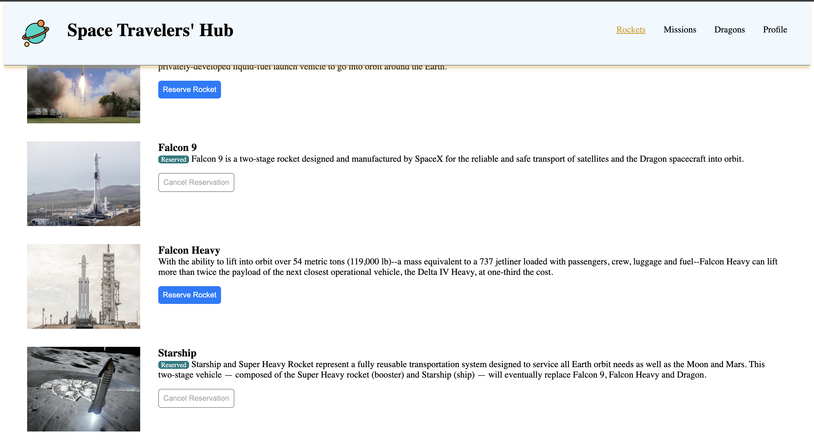
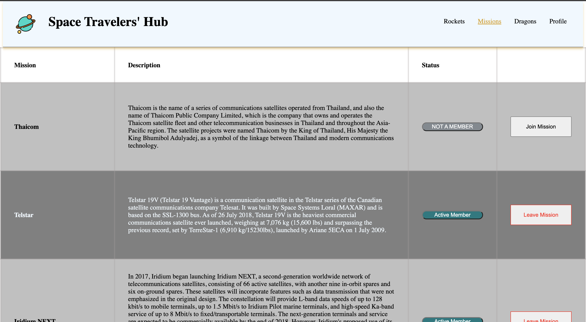
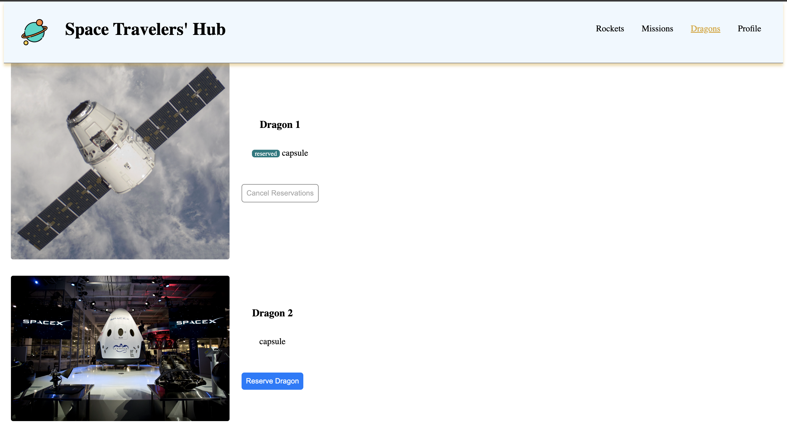
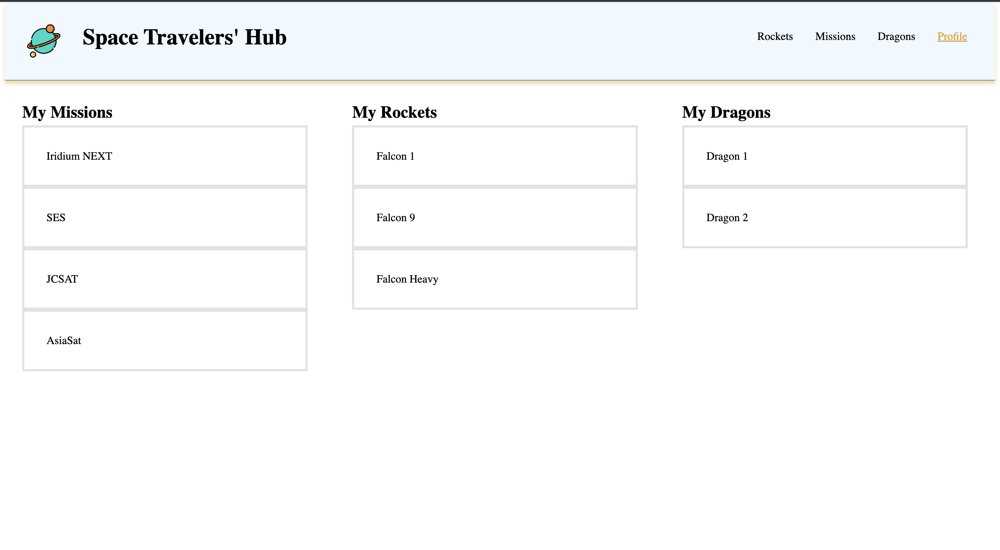

# Space Travelers' Hub

In this project, we worked with the real live data from the SpaceX API. We managed to build a web application for a company that provides commercial and scientific space travel services. The application allows users to book rockets, dragons, and to join selected space missions. All activities are recorded and displayed in the Profile section.
The screenshots below give a glimpse of the beautiful UI. To access the web application, click the link in the `live demo` section.
Support us with a star if you like the project, and feel free to contribute or offer any insight.

## Screenshots

## Built With

- React
- Redux
- JavaScript
- Jest
- Webpack

## Live Demo

[This is the link](https://6262b54ee8f3d52d5200c258--tiny-bavarois-1b6015.netlify.app/) to the deployed web application.

## Getting Started

To get a local copy up and running follow these simple example steps.

### Prerequisites

You need nodejs and npm installed on your machine. If so, continue with the next steps.

### Setup

Install dependencies by running:

`npm install`

### Usage

Run live server by the following command:

`npm start`

### Run tests

`npm test`

### Deployment

To deploy this project run the following command:

`npm build`

and copy the content of `build` directory to the root folder of your production environment.

## Authors

👤 **Nicholas Mutale**

- GitHub: [@Mutalenic](https://github.com/Mutalenic)
- Twitter: [@bonke_gcobo](https://twitter.com/nicomutale)
- LinkedIn: [LinkedIn](https://linkedin.com/in/nicomutale)

👤 **Moise Mulungu**

- GitHub: [Moise Mulungu](https://github.com/moise-mulungu)
- Twitter: [Moise Mulungu](https://twitter.com/moise_mulungu)
- LinkedIn: [Moise Mulungu](https://www.linkedin.com/in/moisemulungu/)

👤 **Chia Carlyle**

- GitHub: [@carlylechia](https://github.com/carlylechia)
- Twitter: [@ChiaCarlyle](https://twitter.com/ChiaCarlyle)
- LinkedIn: [@ChiaCarlyle](https://www.linkedin.com/in/chia-carlyle/)

## 🤝 Contributing

Contributions, issues, and feature requests are welcome!

## Show your support

Give a ⭐️ if you like this project!

## Acknowledgments

- Linters configuration are made by Microverse
- The logo has been taken from flaticon.com.

## LICENSE
This project is MIT licensed.